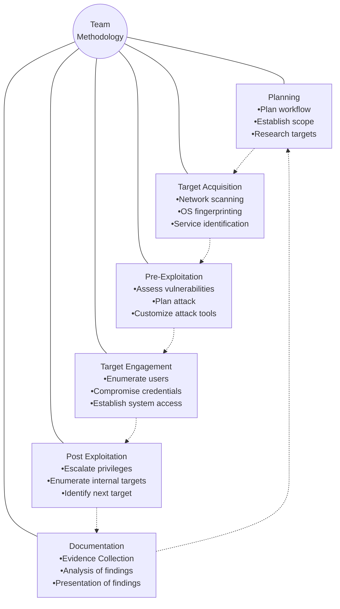

# Final VAPT Report


**PREPARED BY**: Michael Cyber Defense
**Submitted To**: TechShield
**Submission Date**: 15.09.2025

*Sensitive: The information in this document is strictly confidential and is intended for \<COMPANY NAME\>*

# TABLE OF CONTENTS

EXECUTIVE SUMMARY 3

HIGH LEVEL ASSESSMENT OVERVIEW 4
* Observed Security Strengths 4
* Areas for Improvement 4
    - Short Term Recommendations 4
    - Long Term Recommendations 5

SCOPE 6
* Project Scope 6
* Network Information 6

TESTING METHODOLOGY 8

CLASSIFICATION DEFINITIONS 9
* Risk Classifications 9
* Exploitation Likelihood Classifications 9
* Business Impact Classifications 10
* Remediation Difficulty Classifications 10

ASSESSMENT FINDINGS 12

FORENSIC EVIDENCE COLLECTION AND ANALYSIS **Error! Bookmark not defined.**

APPENDIX A - TOOLS USED 13

APPENDIX B - ENGAGEMENT INFORMATION 14
* Client Information 14
* Version Information 14
* Contact Information 14

Techshield CONFIDENTIAL Page 2

# EXECUTIVE SUMMARY

Michael Cyber Defense performed a security assessment of the internal corporate network of TechShield on September 3, 2025. Michael’ Cyber Defense’ penetration test simulated an attack from an external threat actor attempting to gain access to systems within the TechSchield’s corporate network. The purpose of this assessment was to discover and identify vulnerabilities in TechShield’s infrastructure and suggest methods to remediate the vulnerabilities. Michael Cyber Defense identified 4 vulnerabilities on Windows Workstation 192.168.57.20 and 55 vulnerabilities on the Application Server 192.168.57.30 with different severity levels, which gives a total of **59** vulnerabilities within the scope of the engagement; these are broken down by severity in the table below.

<table>
  <thead>
    <tr>
        <th>CRITICAL</th>
        <th>HIGH</th>
        <th>MEDIUM</th>
        <th>LOW</th>
    </tr>
  </thead>
  <tbody>
    <tr>
        <td>9</td>
        <td>11</td>
        <td>33</td>
        <td>6</td>
    </tr>
  </tbody>
</table>

The highest severity vulnerabilities give potential attackers or intruders the opportunity to perform undesirable activities, such as running malicious code remotely on the systems, capitalizing on the End-of-Life Operating System that cannot obtain security patches for the specific purpose of correcting an observed weakness to prevent exploitation of the vulnerability. Based on the vulnerability detection results, provided by a powerful tool, named OpenVAS tool, the Windows 7 Operating System on the remote has reached the End-of-Life **{CVSS: 10.0}**, and is no longer eligible to receiving security patches issued by the vendor. Pertaining to the high vulnerability of the CVSS score, Microsoft Windows SMB Server was identified for multiple Vulnerabilities. The host is missing a critical update to the Microsoft Server and multiple flaws exist due to the way that Microsoft Server Message Block 1.0 (SMBv1) server handles certain requests. A successful exploitation of this will allow remote attackers to be able to execute codes on the target server, which could also lead to information disclosure from the server. In order to ensure data confidentiality, integrity, and availability, security remediations should be implemented as described in the security assessment findings.

Note that this assessment may not disclose all vulnerabilities that are present on the systems within the scope. Any changes made to the environment during the period of testing may affect the results of the assessment.

Techshield CONFIDENTIAL Page 3

# HIGH LEVEL ASSESSMENT OVERVIEW

## Observed Security Strengths

Michael Cyber Defense identified the following strengths in TechShield’s network which greatly increases the security of the network. TechShield should continue to monitor these controls to ensure they remain effective.

### Security Strength

*   Configuration of a firewall to control the flow of information between computing devices and the internet
*   DVWA Damn Vulnerable Web Application Server is configured by default to high security mode, enhancing the ability to escape input field data and code execution to an extent. Although high security mode is not enough Attackers can still manage to escape or circumvent their input, Unicode, injection strings or other encodings that may end up defeating your sanitization input.
*   The printer server revealed no weaknesses or liability to no security flaws, which indicates a desired security configuration

## Areas for Improvement

Michael Cyber Defense recommends TechShield takes the following actions to improve the security of the network. Implementing these recommendations will reduce the likelihood that an attacker will be able to successfully attack TechShield’s information systems and/or reduce the impact of a successful attack.

## Short Term Recommendations

Michael Cyber Defense recommends TechShield take the following actions as soon as possible to minimize business risk.

### Security Patches and Hardening

 Apply vendor fix, in accordance to the vendor’s issuance of updates, against multiple flaws due to the way Microsoft Windows Server Message Block 1.0 (SmBv1) server handles request

Techshield CONFIDENTIAL Page 4

* Filter incoming traffic to port 135 for services running on the host via the TCP protocol
* Reverse and disable TCP timestamps on Windows system to mitigate uptime computing of the remote host

## Long Term Recommendations

Michael Cyber Defense recommends the following actions be taken over the next 6 months to fix hard-to-remediate issues that do not pose an urgent risk to the business.

* Upgrade all the End-of-Life operating systems to a version still support and receiving security patches by the vendor
* Regular Network auditing and Event Logging as a pre-planned monitoring method
* Installing firewalls and intrusion detection system
* Dedicate a portion of their network to a security structure called DMZ Demilitarized zone
    - Web Servers
    - Mail Servers
    - FTP servers
    - VoIP Servers
    - Implementation of Honeypots (Decoy server) as another perimeter network- security structure to lure attackers from gaining access to legitimate intranet resources
* Hardening security configurations of all old and newly installed operating systems in form of service packs, patches, and updates.
* Only allow input characters from a whitelist to be entered
* Escape input field data
* Disabling of nonessential services, unnecessary software and Operating System (OS) default features
* The use of Anti-Malware software
* We additionally recommend performing a retest to ensure that the proposed countermeasures are effective and the risk is successfully mitigated, which Michael Cyber Defense will be honored to conduct again when needed.

Techshield CONFIDENTIAL Page 5

# SCOPE

## Project Scope

All testing was based on the scope as defined in the Request for Proposal (RFP) and official written communications. The items in scope are listed below.

*   Web Server
*   Database Server
*   Centralized Directory
*   Or Campus Network (LAN)

## Network Information

<table>
  <thead>
    <tr>
        <th>Network</th>
        <th>Note</th>
    </tr>
  </thead>
  <tbody>
    <tr>
        <td>192.168.57.20</td>
        <td>Victim-Laptop</td>
    </tr>
    <tr>
        <td>192.168.57.30</td>
        <td>Web Application-Server (DVWA)</td>
    </tr>
    <tr>
        <td>192.168.57.40</td>
        <td>OpenVAS/Greenbone</td>
    </tr>
    <tr>
        <td>192.168.57.250</td>
        <td>Printer</td>
    </tr>
    <tr>
        <td>192.168.57.254</td>
        <td>Router/Firewall</td>
    </tr>
    <tr>
        <td>192.168.57.10</td>
        <td>Penetration Tester</td>
    </tr>
  </tbody>
</table>

Techshield CONFIDENTIAL Page 6

```description
A thick blue horizontal line is located at the top left of the page.
```

Techshield CONFIDENTIAL Page 7

# TESTING METHODOLOGY

Michael Cyber Defense’s testing methodology was split into three phases: *Reconnaissance*, *Target Assessment*, and *Execution of Vulnerabilities*. During reconnaissance, we gathered information about Techshield’s network systems. Michael Cyber Defense used port scanning and other enumeration methods to refine target information and assess target values. Next, we conducted our targeted assessment. Michael Cyber Defense simulated an attacker exploiting vulnerabilities in the Techshield network. Michael Cyber Defense gathered evidence of vulnerabilities during this phase of the engagement while conducting the simulation in a manner that would not disrupt normal business operations.

The following image is a graphical representation of this methodology.



Techshield CONFIDENTIAL Page 8

# CLASSIFICATION DEFINITIONS

## Risk Classifications

<table>
  <thead>
    <tr>
        <th>Level</th>
        <th>Score</th>
        <th>Description</th>
    </tr>
  </thead>
  <tbody>
    <tr>
        <td>Critical</td>
        <td>10</td>
        <td>The vulnerability poses an immediate threat to the organization. Successful exploitation may permanently affect the organization. Remediation should be immediately performed.</td>
    </tr>
    <tr>
        <td>High</td>
        <td>7-9</td>
        <td>The vulnerability poses an urgent threat to the organization, and remediation should be prioritized.</td>
    </tr>
    <tr>
        <td>Medium</td>
        <td>4-6</td>
        <td>Successful exploitation is possible and may result in notable disruption of business functionality. This vulnerability should be remediated when feasible.</td>
    </tr>
    <tr>
        <td>Low</td>
        <td>1-3</td>
        <td>The vulnerability poses a negligible/minimal threat to the organization. The presence of this vulnerability should be noted and remediated if possible.</td>
    </tr>
    <tr>
        <td>Informational</td>
        <td>0</td>
        <td>These findings have no clear threat to the organization but may cause business processes to function differently than desired or reveal sensitive information about the company.</td>
    </tr>
  </tbody>
</table>

## Exploitation Likelihood Classifications

<table>
  <thead>
    <tr>
        <th>Likelihood</th>
        <th>Description</th>
    </tr>
  </thead>
  <tbody>
    <tr>
        <td>Likely</td>
        <td>Exploitation methods are well-known and can be performed using publicly available tools. Low-skilled attackers and automated tools could successfully exploit the vulnerability with minimal difficulty.</td>
    </tr>
    <tr>
        <td>Possible</td>
        <td>Exploitation methods are well-known, may be performed using public tools, but require configuration. Understanding of the underlying system is required for successful exploitation.</td>
    </tr>
    <tr>
        <td>Unlikely</td>
        <td>Exploitation requires deep understanding of the underlying systems or advanced technical skills. Precise conditions may be required for successful exploitation.</td>
    </tr>
  </tbody>
</table>

Techshield CONFIDENTIAL Page 9

# Business Impact Classifications

<table>
  <thead>
    <tr>
        <th>Impact</th>
        <th>Description</th>
    </tr>
  </thead>
  <tbody>
    <tr>
        <td>&lt;mark style="background-color: red"&gt;**Major**</mark></td>
        <td>Successful exploitation may result in large disruptions of critical business functions across the organization and significant financial damage.</td>
    </tr>
    <tr>
        <td>&lt;mark style="background-color: yellow"&gt;**Moderate**</mark></td>
        <td>Successful exploitation may cause significant disruptions to non-critical business functions.</td>
    </tr>
    <tr>
        <td>&lt;mark style="background-color: green"&gt;**Minor**</mark></td>
        <td>Successful exploitation may affect few users, without causing much disruption to routine business functions.</td>
    </tr>
  </tbody>
</table>

# Remediation Difficulty Classifications

<table>
  <thead>
    <tr>
        <th>Difficulty</th>
        <th>Description</th>
    </tr>
  </thead>
  <tbody>
    <tr>
        <td>&lt;mark style="background-color: red"&gt;**Hard**</mark></td>
        <td>Remediation may require extensive reconfiguration of underlying systems that is time consuming. Remediation may require disruption of normal business functions.</td>
    </tr>
    <tr>
        <td>&lt;mark style="background-color: yellow"&gt;**Moderate**</mark></td>
        <td>Remediation may require minor reconfigurations or additions that may be time-intensive or expensive.</td>
    </tr>
    <tr>
        <td>&lt;mark style="background-color: green"&gt;**Easy**</mark></td>
        <td>Remediation can be accomplished in a short amount of time, with little difficulty.</td>
    </tr>
  </tbody>
</table>

Techshield CONFIDENTIAL Page 10

```description
A blue horizontal bar is located at the top left of the page.
```

Techshield CONFIDENTIAL Page 11

# ASSESSMENT FINDINGS

<table>
  <tbody>
    <tr>
        <td>Number</td>
        <td>Finding</td>
        <td>Risk Score</td>
        <td>Risk</td>
    </tr>
    <tr>
        <th>1</th>
        <th>End-of-Live Operating Systems</th>
        <th>&lt;mark style="background-color: red"&gt;**10.0**</mark></th>
        <th>&lt;mark style="background-color: red"&gt;**Critical**</mark></th>
    </tr>
    <tr>
        <th>2</th>
        <th>Multiple Vulnerabilities on Microsoft Windows Server Message Block 1.0 (SmBv1)</th>
        <th>&lt;mark style="background-color: red"&gt;**8.1**</mark></th>
        <th>&lt;mark style="background-color: red"&gt;**High**</mark></th>
    </tr>
    <tr>
        <th>3</th>
        <th>Distributed Computing Environment / Remote Procedure Calls (DCE/RCE) Services Enumeration Reporting</th>
        <th>&lt;mark style="background-color: yellow"&gt;**5.0**</mark></th>
        <th>&lt;mark style="background-color: yellow"&gt;**Medium**</mark></th>
    </tr>
    <tr>
        <th>5</th>
        <th>Transport Control Protocol (TCP) Timestamps</th>
        <th>&lt;mark style="background-color: green"&gt;**2.6**</mark></th>
        <th>&lt;mark style="background-color: green"&gt;**Low**</mark></th>
    </tr>
  </tbody>
</table>
TEMPLATE NOTE: (Sorting by descending risk score)

Techshield CONFIDENTIAL Page 12

# APPENDIX A - TOOLS USED

<table>
  <thead>
    <tr>
        <th>TOOL</th>
        <th>DESCRIPTION</th>
    </tr>
  </thead>
  <tbody>
    <tr>
        <td>**Metasploit**</td>
        <td>Used for exploitation of vulnerable services and vulnerability scanning.</td>
    </tr>
    <tr>
        <td>**Nmap**</td>
        <td>Used for scanning ports on hosts.</td>
    </tr>
    <tr>
        <td>**OpenVAS**</td>
        <td>Used to scan the networks for vulnerabilities.</td>
    </tr>
    <tr>
        <td>**Autopsy**</td>
        <td>Used to connect to conduct Digital Forensic Investigation</td>
    </tr>
  </tbody>
</table>

*Table A.1: Tools used during assessment*

Techshield CONFIDENTIAL	Page 13

# APPENDIX B - ENGAGEMENT INFORMATION

## Client Information

<table>
  <thead>
    <tr>
        <th>Client</th>
        <th>MichaelCyber Defense</th>
    </tr>
    <tr>
        <th>Primary Contact</th>
        <th>John Doe<br/>CEO</th>
    </tr>
    <tr>
        <th>Approvers</th>
        <th>The following people are authorized to change the scope of engagement and modify the terms of the engagement<br/>● CEO, TechShield<br/>● CISO, TechShield</th>
    </tr>
  </thead>
</table>

## Version Information

<table>
  <thead>
    <tr>
        <th>Version</th>
        <th>Date</th>
        <th>Description</th>
    </tr>
  </thead>
  <tbody>
    <tr>
        <td>1.0</td>
        <td>15.09.2025</td>
        <td>Initial report to client</td>
    </tr>
  </tbody>
</table>

## Contact Information

<table>
  <thead>
    <tr>
        <th>Name</th>
        <th>MichaelCyber Defense</th>
    </tr>
    <tr>
        <th>Address</th>
        <th>Berlin, Germany</th>
    </tr>
    <tr>
        <th>Phone</th>
        <th>555-185-1782</th>
    </tr>
    <tr>
        <th>Email</th>
        <th><u>michael@michaelcyberdefense.com</u></th>
    </tr>
  </thead>
</table>

Techshield CONFIDENTIAL Page 14
